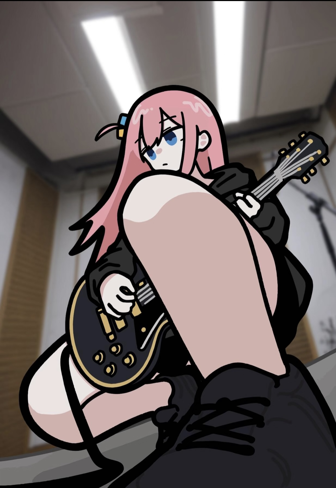
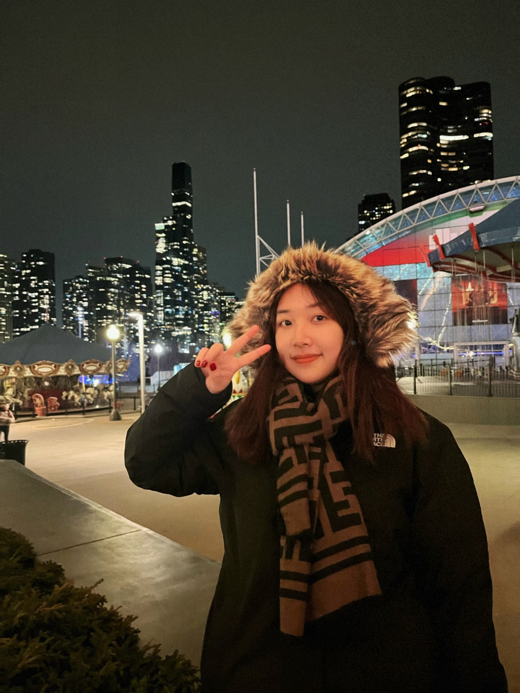

<!-- Banner Image -->

<!-- Animated Header -->

<!-- Typing Animation -->

  

<!-- Profile Badges -->

---

### Tech Stack

---

### About Me

- I'm ✨ **@lytreallynb** ✨
- I'm studying **Data Science** at the **University of Michigan, Ann Arbor** 💙💛
- I'm interested in **AI**, **Machine Learning Engineering**, **Software Engineering**, and **product-building**
- I'm looking to collaborate on **AI/ML projects**, **developer tools**, and **open source**
- I speak Cantonese but still need to learn more on Duolingo 👉👈
- Hobbies: **badminton** 🏸, **music, photography, philosophy**
- Reach me at **[yutonglvv@gmail.com](mailto:yutonglvv@gmail.com)**
- Portfolio: **[yutonglv.com](https://yutonglv.com)**

---

### Interesting Projects

- **[Job Tracker](https://job-tracker-pi-six.vercel.app)** — I built this to track job applications without the headache, good for lazy and busy people (like me) 😆
- **[AI Creator Copilot](https://ai-creator-copilot.vercel.app)** — see my AI vibe coding PM project! trying to make good PM sense and actually it works 🎵
- **[Typing](https://typingtyping-lytreallynbs-projects.vercel.app)** — wanna click faster? try this and also expand your bilingual vocabulary ⌨️

---

### Beyond Code

- Languages: **Mandarin, Cantonese, English**
- Cat lover — I have **two cats**

  
  &nbsp;
  
  &nbsp;
  

---

<!-- GitHub Stats -->

 

---

